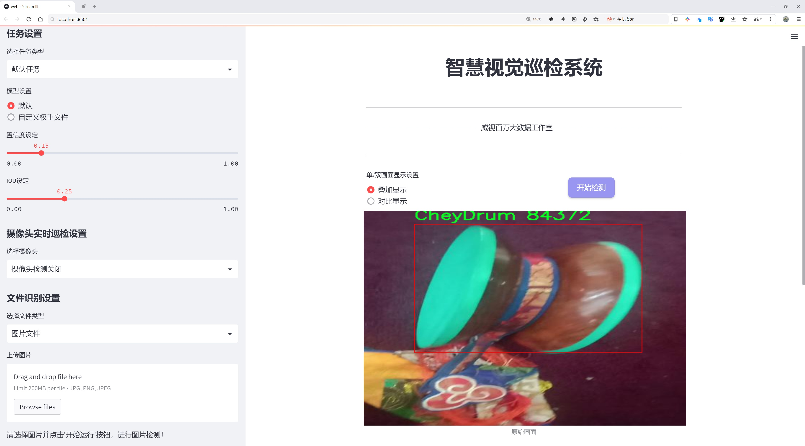
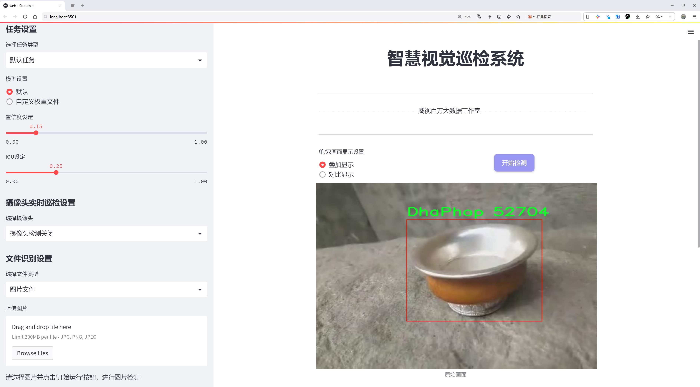
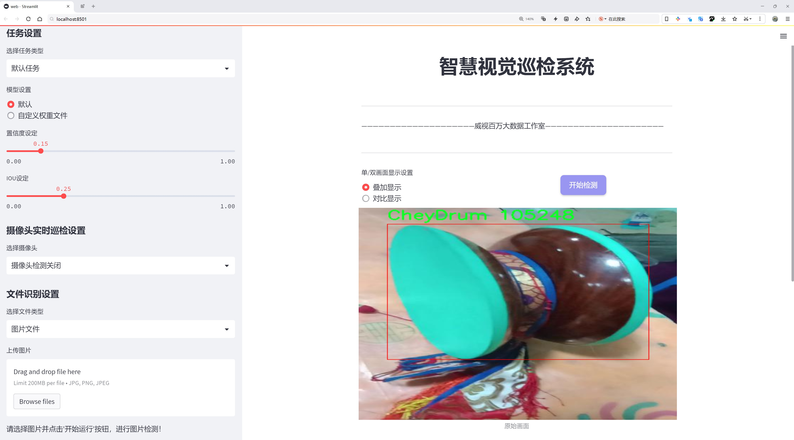
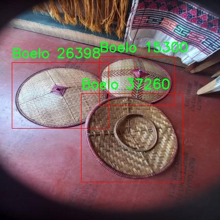
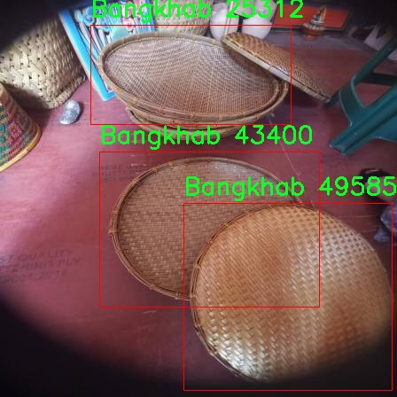
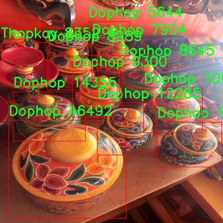
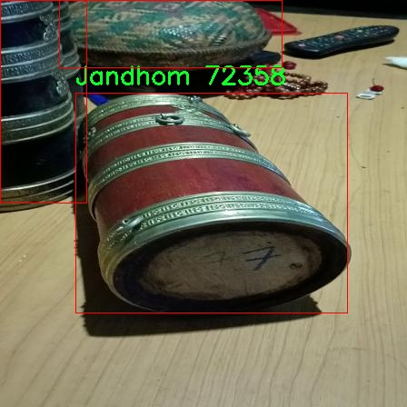
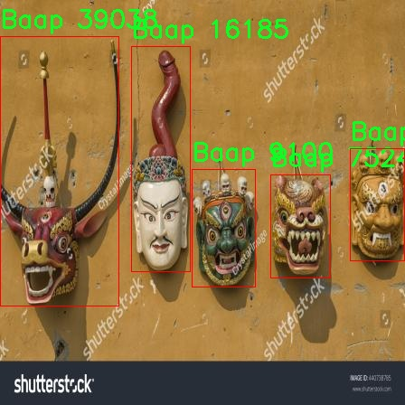

# 传统少数民族物品检测系统源码分享
 # [一条龙教学YOLOV8标注好的数据集一键训练_70+全套改进创新点发刊_Web前端展示]

### 1.研究背景与意义

项目参考[AAAI Association for the Advancement of Artificial Intelligence](https://gitee.com/qunmasj/projects)

项目来源[AACV Association for the Advancement of Computer Vision](https://kdocs.cn/l/cszuIiCKVNis)

研究背景与意义

在全球化迅速发展的今天，传统少数民族文化的保护与传承面临着前所未有的挑战。尤其是在物品识别与分类领域，传统手工艺品的多样性和复杂性使得相关研究变得尤为重要。以不丹为例，该国拥有丰富的民族文化和独特的手工艺品，这些物品不仅是文化的象征，更是经济发展的重要组成部分。然而，传统的物品识别方法往往依赖于人工经验，效率低下且易受主观因素影响。因此，基于计算机视觉技术的物品检测系统的研究显得尤为迫切。

本研究旨在基于改进的YOLOv8模型，构建一个高效的传统少数民族物品检测系统，特别是针对不丹的物品进行识别与分类。YOLO（You Only Look Once）系列模型因其快速和准确的特性，广泛应用于实时物体检测任务。通过对YOLOv8模型的改进，我们希望能够提高对不丹传统物品的检测精度和速度，从而为文化遗产的保护与传承提供技术支持。

在本研究中，我们使用的数据集包含5942张图像，涵盖20个类别的传统不丹物品。这些类别包括Baap、Bangchung、Bangkhab等，每一类物品都承载着独特的文化内涵和历史背景。通过对这些物品的自动化检测与分类，我们不仅能够提升物品识别的效率，还能够为后续的文化研究提供数据支持。特别是在当前数字化转型的背景下，如何有效地将传统文化与现代科技结合，是我们必须面对的重要课题。

此外，构建一个高效的物品检测系统还有助于推动不丹手工艺品的市场化和国际化。随着全球对传统手工艺品的关注度不断上升，如何利用先进的技术手段提升产品的可见性和市场竞争力，成为了不丹工匠和商家的重要任务。通过实现对传统物品的快速识别和分类，我们能够为消费者提供更为便捷的购物体验，同时也为不丹的手工艺品打开更广阔的市场。

综上所述，本研究不仅具有重要的学术价值，也具备显著的社会意义。通过基于改进YOLOv8的传统少数民族物品检测系统，我们希望能够为传统文化的保护与传承提供新的思路和方法。同时，推动传统手工艺品的市场化发展，为不丹的经济增长贡献力量。未来，我们期待这一研究能够为其他少数民族的物品检测提供借鉴，促进全球范围内的文化交流与理解。

### 2.图片演示







##### 注意：由于此博客编辑较早，上面“2.图片演示”和“3.视频演示”展示的系统图片或者视频可能为老版本，新版本在老版本的基础上升级如下：（实际效果以升级的新版本为准）

  （1）适配了YOLOV8的“目标检测”模型和“实例分割”模型，通过加载相应的权重（.pt）文件即可自适应加载模型。

  （2）支持“图片识别”、“视频识别”、“摄像头实时识别”三种识别模式。

  （3）支持“图片识别”、“视频识别”、“摄像头实时识别”三种识别结果保存导出，解决手动导出（容易卡顿出现爆内存）存在的问题，识别完自动保存结果并导出到tempDir中。

  （4）支持Web前端系统中的标题、背景图等自定义修改，后面提供修改教程。

  另外本项目提供训练的数据集和训练教程,暂不提供权重文件（best.pt）,需要您按照教程进行训练后实现图片演示和Web前端界面演示的效果。

### 3.视频演示

[3.1 视频演示](https://www.bilibili.com/video/BV1pA1yYUE5B/)

### 4.数据集信息展示

##### 4.1 本项目数据集详细数据（类别数＆类别名）

nc: 20
names: ['Baap', 'Bangchung', 'Bangkhab', 'Baykhu', 'Boelo', 'Changsho', 'CheyDrum', 'Dapa', 'Dha', 'DhaPhop', 'Dophop', 'Dramnyen', 'DungShub', 'Jandhom', 'LagchuDapa', 'Nga', 'Thopkay', 'Tseo', 'Zaru', 'Zepchu']


##### 4.2 本项目数据集信息介绍

数据集信息展示

在当今计算机视觉领域，物体检测技术的进步为传统少数民族物品的识别与保护提供了新的机遇。本研究采用的“Bhutanese Object Detection”数据集，专门针对不丹的传统物品进行分类与检测，旨在改进YOLOv8模型的性能，以更好地适应少数民族文化遗产的数字化保护需求。该数据集包含20个独特的类别，涵盖了不丹丰富的文化和手工艺品，具体类别包括：Baap、Bangchung、Bangkhab、Baykhu、Boelo、Changsho、CheyDrum、Dapa、Dha、DhaPhop、Dophop、Dramnyen、DungShub、Jandhom、LagchuDapa、Nga、Thopkay、Tseo、Zaru、Zepchu。

每个类别代表了不丹文化中不可或缺的元素，具有深厚的历史和文化背景。例如，Baap是一种传统的手工艺品，通常用于节庆和宗教仪式，而Bangchung则是用来盛放食物的器具，体现了不丹人民的生活方式和饮食文化。Bangkhab和Baykhu则是不丹特有的乐器，反映了该地区丰富的音乐传统。通过对这些物品的检测与分类，研究不仅能够提高物体识别的准确性，还能为不丹的文化遗产保护提供重要的数据支持。

数据集的构建过程注重多样性和代表性，确保每个类别的样本均能充分反映其在实际应用中的特征。这一过程包括从不同的角度、光照条件和背景下采集样本，以增强模型的鲁棒性。此外，数据集中的图像经过精心标注，确保每个物体的边界框准确无误，从而为YOLOv8模型的训练提供高质量的输入。

在训练过程中，YOLOv8模型将利用这些标注良好的图像进行学习，逐步提高对各类不丹传统物品的识别能力。通过对数据集的深入分析与挖掘，研究者可以发现不同物品之间的相似性与差异性，从而为后续的模型优化提供依据。同时，模型的改进不仅限于检测精度的提升，还包括对少数民族物品在实际应用场景中的适应性分析，确保其在多种环境下均能保持良好的性能。

综上所述，“Bhutanese Object Detection”数据集为研究不丹传统物品的检测与识别提供了坚实的基础。通过对该数据集的深入利用，研究者不仅能够推动YOLOv8模型的技术进步，还能为保护和传承不丹独特的文化遗产贡献力量。未来，随着数据集的不断扩展与更新，期待能够在更广泛的应用场景中实现更高效的物体检测，为少数民族文化的保护与发展开辟新的路径。











### 5.全套项目环境部署视频教程（零基础手把手教学）

[5.1 环境部署教程链接（零基础手把手教学）](https://www.ixigua.com/7404473917358506534?logTag=c807d0cbc21c0ef59de5)


[5.2 安装Python虚拟环境创建和依赖库安装视频教程链接（零基础手把手教学）](https://www.ixigua.com/7404474678003106304?logTag=1f1041108cd1f708b01a)

### 6.手把手YOLOV8训练视频教程（零基础小白有手就能学会）

[6.1 手把手YOLOV8训练视频教程（零基础小白有手就能学会）](https://www.ixigua.com/7404477157818401292?logTag=d31a2dfd1983c9668658)


按照上面的训练视频教程链接加载项目提供的数据集，运行train.py即可开始训练



     Epoch   gpu_mem       box       obj       cls    labels  img_size
     1/200     20.8G   0.01576   0.01955  0.007536        22      1280: 100%|██████████| 849/849 [14:42<00:00,  1.04s/it]
               Class     Images     Labels          P          R     mAP@.5 mAP@.5:.95: 100%|██████████| 213/213 [01:14<00:00,  2.87it/s]
                 all       3395      17314      0.994      0.957      0.0957      0.0843

     Epoch   gpu_mem       box       obj       cls    labels  img_size
     2/200     20.8G   0.01578   0.01923  0.007006        22      1280: 100%|██████████| 849/849 [14:44<00:00,  1.04s/it]
               Class     Images     Labels          P          R     mAP@.5 mAP@.5:.95: 100%|██████████| 213/213 [01:12<00:00,  2.95it/s]
                 all       3395      17314      0.996      0.956      0.0957      0.0845

     Epoch   gpu_mem       box       obj       cls    labels  img_size
     3/200     20.8G   0.01561    0.0191  0.006895        27      1280: 100%|██████████| 849/849 [10:56<00:00,  1.29it/s]
               Class     Images     Labels          P          R     mAP@.5 mAP@.5:.95: 100%|███████   | 187/213 [00:52<00:00,  4.04it/s]
                 all       3395      17314      0.996      0.957      0.0957      0.0845


### 7.70+种全套YOLOV8创新点代码加载调参视频教程（一键加载写好的改进模型的配置文件）

[7.1 70+种全套YOLOV8创新点代码加载调参视频教程（一键加载写好的改进模型的配置文件）](https://www.ixigua.com/7404478314661806627?logTag=29066f8288e3f4eea3a4)

### 8.70+种全套YOLOV8创新点原理讲解（非科班也可以轻松写刊发刊，V10版本正在科研待更新）

#### 由于篇幅限制，每个创新点的具体原理讲解就不一一展开，具体见下列网址中的创新点对应子项目的技术原理博客网址【Blog】：


[8.1 70+种全套YOLOV8创新点原理讲解链接](https://gitee.com/qunmasj/good)

#### 部分改进原理讲解(完整的改进原理见上图和技术博客链接)
### YOLOv8简介
#### Backbone


借鉴了其他算法的这些设计思想

借鉴了VGG的思想，使用了较多的3×3卷积，在每一次池化操作后，将通道数翻倍；

借鉴了network in network的思想，使用全局平均池化（global average pooling）做预测，并把1×1的卷积核置于3×3的卷积核之间，用来压缩特征；（我没找到这一步体现在哪里）

使用了批归一化层稳定模型训练，加速收敛，并且起到正则化作用。

    以上三点为Darknet19借鉴其他模型的点。Darknet53当然是在继承了Darknet19的这些优点的基础上再新增了下面这些优点的。因此列在了这里

借鉴了ResNet的思想，在网络中大量使用了残差连接，因此网络结构可以设计的很深，并且缓解了训练中梯度消失的问题，使得模型更容易收敛。

使用步长为2的卷积层代替池化层实现降采样。（这一点在经典的Darknet-53上是很明显的，output的长和宽从256降到128，再降低到64，一路降低到8，应该是通过步长为2的卷积层实现的；在YOLOv8的卷积层中也有体现，比如图中我标出的这些位置）

#### 特征融合

模型架构图如下

  Darknet-53的特点可以这样概括：（Conv卷积模块+Residual Block残差块）串行叠加4次

  Conv卷积层+Residual Block残差网络就被称为一个stage


上面红色指出的那个，原始的Darknet-53里面有一层 卷积，在YOLOv8里面，把一层卷积移除了

为什么移除呢？

        原始Darknet-53模型中间加的这个卷积层做了什么？滤波器（卷积核）的个数从 上一个卷积层的512个，先增加到1024个卷积核，然后下一层卷积的卷积核的个数又降低到512个

        移除掉这一层以后，少了1024个卷积核，就可以少做1024次卷积运算，同时也少了1024个3×3的卷积核的参数，也就是少了9×1024个参数需要拟合。这样可以大大减少了模型的参数，（相当于做了轻量化吧）

        移除掉这个卷积层，可能是因为作者发现移除掉这个卷积层以后，模型的score有所提升，所以才移除掉的。为什么移除掉以后，分数有所提高呢？可能是因为多了这些参数就容易，参数过多导致模型在训练集删过拟合，但是在测试集上表现很差，最终模型的分数比较低。你移除掉这个卷积层以后，参数减少了，过拟合现象不那么严重了，泛化能力增强了。当然这个是，拿着你做实验的结论，反过来再找补，再去强行解释这种现象的合理性。

过拟合


通过MMdetection官方绘制册这个图我们可以看到，进来的这张图片经过一个“Feature Pyramid Network(简称FPN)”，然后最后的P3、P4、P5传递给下一层的Neck和Head去做识别任务。 PAN（Path Aggregation Network）


“FPN是自顶向下，将高层的强语义特征传递下来。PAN就是在FPN的后面添加一个自底向上的金字塔，对FPN补充，将低层的强定位特征传递上去，

FPN是自顶（小尺寸，卷积次数多得到的结果，语义信息丰富）向下（大尺寸，卷积次数少得到的结果），将高层的强语义特征传递下来，对整个金字塔进行增强，不过只增强了语义信息，对定位信息没有传递。PAN就是针对这一点，在FPN的后面添加一个自底（卷积次数少，大尺寸）向上（卷积次数多，小尺寸，语义信息丰富）的金字塔，对FPN补充，将低层的强定位特征传递上去，又被称之为“双塔战术”。

FPN层自顶向下传达强语义特征，而特征金字塔则自底向上传达强定位特征，两两联手，从不同的主干层对不同的检测层进行参数聚合,这样的操作确实很皮。
#### 自底向上增强

而 PAN（Path Aggregation Network）是对 FPN 的一种改进，它的设计理念是在 FPN 后面添加一个自底向上的金字塔。PAN 引入了路径聚合的方式，通过将浅层特征图（低分辨率但语义信息较弱）和深层特征图（高分辨率但语义信息丰富）进行聚合，并沿着特定的路径传递特征信息，将低层的强定位特征传递上去。这样的操作能够进一步增强多尺度特征的表达能力，使得 PAN 在目标检测任务中表现更加优秀。


### 可重参化EfficientRepBiPAN优化Neck
#### Repvgg-style
Repvgg-style的卷积层包含
卷积+ReLU结构，该结构能够有效地利用硬件资源。

在训练时，Repvgg-style的卷积层包含
卷积、
卷积、identity。（下图左图）


在推理时，通过重参数化（re-parameterization），上述的多分支结构可以转换为单分支的
卷积。（下图右图）


基于上述思想，作者设计了对GPU硬件友好的EfficientRep Backbone和Rep-PAN Neck，将它们用于YOLOv6中。

EfficientRep Backbone的结构图：


Rep-PAN Neck结构图：


#### Multi-path
只使用repvgg-style不能达到很好的精度-速度平衡，对于大模型，作者探索了多路径的网络结构。

参考该博客提出了Bep unit，其结构如下图所示：


CSP（Cross Stage Partial）-style计算量小，且有丰富的梯度融合信息，广泛应用于YOLO系列中，比如YOLOv5、PPYOLOE。

作者将Bep unit与CSP-style结合，设计了一种新的网络结构BepC3，如下图所示：


基于BepC3模块，作者设计了新的CSPBep Backbone和CSPRepPAN Neck，以达到很好的精度-速度平衡。

其他YOLO系列在使用CSP-stype结构时，partial ratio设置为1/2。为了达到更好的性能，在YOLOv6m中partial ratio的值为2/3，在YOLOv6l中partial ratio的值为1/2。

对于YOLOv6m，单纯使用Rep-style结构和使用BepC3结构的对比如下图所示：

#### BIFPN
BiFPN 全称 Bidirectional Feature Pyramid Network 加权双向（自顶向下 + 自低向上）特征金字塔网络。

相比较于PANet，BiFPN在设计上的改变：

总结下图：
图d 蓝色部分为自顶向下的通路，传递的是高层特征的语义信息；红色部分是自底向上的通路，传递的是低层特征的位置信息；紫色部分是上述第二点提到的同一层在输入节点和输入节点间新加的一条边。


我们删除那些只有一条输入边的节点。这么做的思路很简单：如果一个节点只有一条输入边而没有特征融合，那么它对旨在融合不同特征的特征网络的贡献就会很小。删除它对我们的网络影响不大，同时简化了双向网络；如上图d 的 P7右边第一个节点

如果原始输入节点和输出节点处于同一层，我们会在原始输入节点和输出节点之间添加一条额外的边。思路：以在不增加太多成本的情况下融合更多的特性；

与只有一个自顶向下和一个自底向上路径的PANet不同，我们处理每个双向路径(自顶向下和自底而上)路径作为一个特征网络层，并重复同一层多次，以实现更高层次的特征融合。如下图EfficientNet 的网络结构所示，我们对BiFPN是重复使用多次的。而这个使用次数也不是我们认为设定的，而是作为参数一起加入网络的设计当中，使用NAS技术算出来的。


Weighted Feature Fusion 带权特征融合：学习不同输入特征的重要性，对不同输入特征有区分的融合。
设计思路：传统的特征融合往往只是简单的 feature map 叠加/相加 (sum them up)，比如使用concat或者shortcut连接，而不对同时加进来的 feature map 进行区分。然而，不同的输入 feature map 具有不同的分辨率，它们对融合输入 feature map 的贡献也是不同的，因此简单的对他们进行相加或叠加处理并不是最佳的操作。所以这里我们提出了一种简单而高效的加权特融合的机制。
常见的带权特征融合有三种方法，分别是：


​
  这种方法比较简单，直接加一个可学习的权重。但是由于这个权重不受限制，所有可能引起训练的不稳定，所有并不推荐。
Softmax-based fusion: O = ∑ i e w i ∗ I i ϵ + ∑ j e w j O = \sum_{i} \frac{e^{w_i} * I_i}{ \epsilon+\sum_{j}e^{w_j}}O=∑ 

 

​
  使用这种方法可以将范围放缩到 [ 0 , 1 ] [0, 1][0,1] 之间，训练稳定，但是训练很慢，所有也不推荐。
Fast normalized fusion: O = ∑ i w i ∗ I i ϵ + ∑ j w j O = \sum_{i} \frac{w_i * I_i}{ \epsilon+\sum_{j}w_j}O=∑ 


### 9.系统功能展示（检测对象为举例，实际内容以本项目数据集为准）

图9.1.系统支持检测结果表格显示

  图9.2.系统支持置信度和IOU阈值手动调节

  图9.3.系统支持自定义加载权重文件best.pt(需要你通过步骤5中训练获得)

  图9.4.系统支持摄像头实时识别

  图9.5.系统支持图片识别

  图9.6.系统支持视频识别

  图9.7.系统支持识别结果文件自动保存

  图9.8.系统支持Excel导出检测结果数据


### 10.原始YOLOV8算法原理

原始YOLOv8算法原理

YOLOv8算法是Ultralytics公司在2023年推出的目标检测领域的一项重要创新，代表了YOLO系列算法的又一次重大进化。与之前的版本相比，YOLOv8不仅在性能上进行了显著提升，还在灵活性和易用性方面做出了优化，使其成为各种计算机视觉任务的理想选择。YOLOv8的设计理念围绕着快速、准确和易于使用展开，尤其适用于目标检测、图像分割和图像分类等多种应用场景。

在YOLOv8的网络结构中，输入层的设计尤为重要。默认情况下，YOLOv8接受640x640像素的图像作为输入。然而，实际应用中，输入图像的长宽比往往各不相同。为了解决这一问题，YOLOv8采用了自适应图片缩放技术。在测试或推理阶段，长边被按比例缩小到指定尺寸，短边则通过填充的方式进行调整。这种方法有效减少了填充区域，从而降低了信息冗余，提升了目标检测的效率。此外，在模型训练阶段，YOLOv8引入了Mosaic图像增强技术。该技术通过随机选择四张图像并进行缩放与拼接，生成新的训练样本，促使模型学习不同位置和周围像素的特征，从而提高了预测精度和模型的整体性能。

YOLOv8的主干网络（Backbone）部分进行了重要的改进，特别是借鉴了YOLOv7中的ELAN模块设计思想。YOLOv8将YOLOv5中的C3模块替换为C2F模块。C3模块依赖于CSPNet的分流思想，而C2F模块则通过并行更多的梯度流分支，增强了信息的传递和处理能力。这种结构的变化不仅保证了模型的轻量化，还显著提高了检测精度和延迟表现。

在特征融合层（Neck）中，YOLOv8进一步优化了结构。与YOLOv5相比，YOLOv8去除了多余的上采样操作，直接将主干网络不同阶段输出的特征进行上采样处理。这种简化的设计使得特征融合更加高效，减少了计算复杂度，同时保持了特征信息的完整性。

YOLOv8在检测头（Head）部分的变化尤为显著。它从耦合头（Coupled-Head）转变为解耦头（Decoupled-Head），实现了检测和分类任务的分离。YOLOv5的检测头结构中，检测和分类共享同一个卷积层，而YOLOv8则采用两个独立的卷积模块，分别用于类别预测和边界框位置及IoU（交并比）预测。这种解耦设计不仅提高了模型的灵活性，还优化了损失函数的设计。YOLOv8中取消了Obj分支，分类分支仍采用二值交叉熵损失（BCELoss），而边界框回归分支则使用分布焦点损失（DFL）和CIoULoss，以快速聚焦于标签附近的数值，提升了模型的学习效率。

值得注意的是，YOLOv8摒弃了传统的基于锚框（Anchor-Based）的方法，转而采用无锚框（Anchor-Free）检测方式。这一创新使得目标检测的过程不再依赖于预设的锚框，避免了在训练前需要对数据集进行聚类的复杂性。通过将目标检测转化为关键点检测，YOLOv8显著提高了模型的泛化能力和简洁性，适应性更强，能够处理多种不同的目标和场景。

在轻量化方面，YOLOv8n模型通过使用更轻量的C2F模块替代C3模块，优化了卷积层的深度和结构，减少了参数量和计算量。同时，特征融合网络中引入了BiFPN（双向特征金字塔网络），进一步提升了对不同尺度特征信息的提取速度和效率。YOLOv8s模型则在YOLOv8的基础上，采用了更强大的特征金字塔网络结构，结合快速空间金字塔池化（SPPF），有效减少了模型的参数量和计算量。

综上所述，YOLOv8算法通过一系列创新的设计和结构优化，不仅提升了目标检测的准确性和速度，还增强了模型的灵活性和适应性。这些改进使得YOLOv8在计算机视觉领域中，尤其是在目标检测任务中，成为一个极具竞争力的解决方案。随着YOLOv8的不断发展和应用，未来在更多实际场景中的表现值得期待。


### 11.项目核心源码讲解（再也不用担心看不懂代码逻辑）

#### 11.1 code\ultralytics\trackers\__init__.py

以下是对给定代码的逐行分析和注释，保留了核心部分并进行了详细的中文注释：

```python
# Ultralytics YOLO 🚀, AGPL-3.0 license

# 从当前包中导入 BOTSORT 类
from .bot_sort import BOTSORT

# 从当前包中导入 BYTETracker 类
from .byte_tracker import BYTETracker

# 从当前包中导入 register_tracker 函数
from .track import register_tracker

# 定义模块的公开接口，允许用户通过简单的方式导入这些类和函数
__all__ = "register_tracker", "BOTSORT", "BYTETracker"  # 允许更简单的导入
```

### 核心部分分析：

1. **导入模块**：
   - `from .bot_sort import BOTSORT`：导入 `BOTSORT` 类，可能用于目标跟踪。
   - `from .byte_tracker import BYTETracker`：导入 `BYTETracker` 类，可能也是用于目标跟踪的另一种实现。
   - `from .track import register_tracker`：导入 `register_tracker` 函数，可能用于注册跟踪器。

2. **公开接口**：
   - `__all__` 列表定义了当使用 `from module import *` 时，哪些名称会被导入。这里包括了 `register_tracker`、`BOTSORT` 和 `BYTETracker`，这使得用户可以更方便地使用这些核心功能。

### 总结：
这段代码主要用于导入和定义目标跟踪相关的类和函数，并设置了模块的公开接口，以便于用户使用。

这个文件是一个Python模块的初始化文件，位于`code/ultralytics/trackers/`目录下。文件的主要功能是导入和暴露一些跟踪器相关的类和函数，以便其他模块可以方便地使用。

首先，文件顶部的注释部分标明了这个项目是Ultralytics YOLO（You Only Look Once）的一部分，并且使用了AGPL-3.0许可证。这表明该项目是开源的，并且遵循特定的许可证条款。

接下来，文件通过相对导入的方式引入了三个重要的组件：`BOTSORT`、`BYTETracker`和`register_tracker`。这些组件分别来自于同一目录下的不同文件。`BOTSORT`和`BYTETracker`是两种不同的目标跟踪算法，而`register_tracker`可能是一个用于注册这些跟踪器的函数。

最后，`__all__`变量定义了当使用`from module import *`语句时，哪些名称会被导入。这里将`register_tracker`、`BOTSORT`和`BYTETracker`列入了`__all__`，这意味着它们是该模块的公共接口，用户可以直接使用这些名称，而不需要知道它们的具体实现细节。

总的来说，这个初始化文件的作用是组织和简化跟踪器相关功能的导入，使得其他模块在使用这些功能时更加方便。

#### 11.2 ui.py

以下是经过简化并添加详细中文注释的核心代码部分：

```python
import sys
import subprocess

def run_script(script_path):
    """
    使用当前 Python 环境运行指定的脚本。

    参数:
        script_path (str): 要运行的脚本路径

    返回:
        None
    """
    # 获取当前 Python 解释器的路径
    python_path = sys.executable

    # 构建运行命令，使用 streamlit 运行指定的脚本
    command = f'"{python_path}" -m streamlit run "{script_path}"'

    # 执行命令并等待其完成
    result = subprocess.run(command, shell=True)
    
    # 检查命令执行的返回码，0 表示成功，非0表示出错
    if result.returncode != 0:
        print("脚本运行出错。")

# 主程序入口
if __name__ == "__main__":
    # 指定要运行的脚本路径
    script_path = "web.py"  # 假设脚本在当前目录下

    # 调用函数运行脚本
    run_script(script_path)
```

### 代码注释说明：
1. **导入模块**：
   - `sys`：用于获取当前 Python 解释器的路径。
   - `subprocess`：用于执行外部命令。

2. **`run_script` 函数**：
   - 该函数接收一个脚本路径作为参数，并在当前 Python 环境中运行该脚本。
   - 使用 `sys.executable` 获取当前 Python 解释器的路径，以确保使用正确的 Python 环境。
   - 构建命令字符串，使用 `streamlit` 模块运行指定的脚本。
   - 使用 `subprocess.run` 执行命令，并等待其完成。
   - 检查命令的返回码，如果不为0，则输出错误信息。

3. **主程序入口**：
   - 使用 `if __name__ == "__main__":` 确保只有在直接运行该脚本时才会执行以下代码。
   - 指定要运行的脚本路径（这里假设脚本名为 `web.py`）。
   - 调用 `run_script` 函数来执行指定的脚本。

这个程序文件的主要功能是使用当前的 Python 环境来运行一个指定的脚本，具体是通过 Streamlit 框架来启动一个 Web 应用。程序首先导入了必要的模块，包括 `sys`、`os` 和 `subprocess`，这些模块分别用于获取系统信息、处理文件路径和执行外部命令。

在 `run_script` 函数中，首先获取当前 Python 解释器的路径，这样可以确保使用的是正确的 Python 环境。接着，构建一个命令字符串，该命令会调用 Streamlit 来运行指定的脚本。命令的格式是 `python -m streamlit run script_path`，其中 `script_path` 是要运行的脚本的路径。

随后，使用 `subprocess.run` 方法来执行这个命令。这个方法会在一个新的进程中运行命令，并等待其完成。如果命令执行后返回的状态码不为零，表示脚本运行过程中出现了错误，此时程序会输出一条错误信息。

在文件的最后部分，使用 `if __name__ == "__main__":` 语句来确保只有在直接运行这个文件时才会执行后面的代码。这里指定了要运行的脚本路径为 `web.py`，并调用 `run_script` 函数来启动这个脚本。

总的来说，这个程序的功能是方便地启动一个 Streamlit Web 应用，确保使用当前 Python 环境，并处理可能出现的错误。

#### 11.3 70+种YOLOv8算法改进源码大全和调试加载训练教程（非必要）\ultralytics\hub\utils.py

以下是代码中最核心的部分，并附上详细的中文注释：

```python
import requests
from ultralytics.utils import TQDM, TryExcept, __version__, ENVIRONMENT, SETTINGS, RANK, ONLINE

def requests_with_progress(method, url, **kwargs):
    """
    使用指定的方法和URL进行HTTP请求，并可选地显示进度条。

    参数:
        method (str): 要使用的HTTP方法（例如 'GET', 'POST'）。
        url (str): 要发送请求的URL。
        **kwargs (dict): 传递给底层 `requests.request` 函数的其他关键字参数。

    返回:
        (requests.Response): HTTP请求的响应对象。
    """
    progress = kwargs.pop('progress', False)  # 从kwargs中获取进度参数
    if not progress:
        return requests.request(method, url, **kwargs)  # 如果没有进度条，直接发送请求

    # 否则，使用流式请求以便显示进度
    response = requests.request(method, url, stream=True, **kwargs)
    total = int(response.headers.get('content-length', 0))  # 获取响应的总大小
    try:
        pbar = TQDM(total=total, unit='B', unit_scale=True, unit_divisor=1024)  # 初始化进度条
        for data in response.iter_content(chunk_size=1024):  # 按块读取响应内容
            pbar.update(len(data))  # 更新进度条
        pbar.close()  # 关闭进度条
    except requests.exceptions.ChunkedEncodingError:  # 捕获分块编码错误
        response.close()  # 关闭响应
    return response  # 返回响应对象

def smart_request(method, url, retry=3, timeout=30, thread=True, verbose=True, progress=False, **kwargs):
    """
    使用'requests'库进行HTTP请求，支持指数退避重试机制。

    参数:
        method (str): 请求使用的HTTP方法。选择 'post' 或 'get'。
        url (str): 要请求的URL。
        retry (int, optional): 在放弃之前尝试的重试次数。默认为3。
        timeout (int, optional): 超时（秒），超时后将放弃重试。默认为30。
        thread (bool, optional): 是否在单独的守护线程中执行请求。默认为True。
        verbose (bool, optional): 是否在控制台打印输出。默认为True。
        progress (bool, optional): 是否在请求期间显示进度条。默认为False。
        **kwargs (dict): 传递给指定方法的请求函数的关键字参数。

    返回:
        (requests.Response): HTTP响应对象。如果请求在单独线程中执行，则返回None。
    """
    retry_codes = (408, 500)  # 仅在这些状态码下重试

    @TryExcept(verbose=verbose)
    def func(func_method, func_url, **func_kwargs):
        """执行带有重试和超时的HTTP请求，支持可选的进度跟踪。"""
        r = None  # 响应对象
        t0 = time.time()  # 记录初始时间
        for i in range(retry + 1):
            if (time.time() - t0) > timeout:  # 检查是否超时
                break
            r = requests_with_progress(func_method, func_url, **func_kwargs)  # 发起请求
            if r.status_code < 300:  # 如果状态码在2xx范围内，表示成功
                break
            # 处理错误信息
            try:
                m = r.json().get('message', 'No JSON message.')
            except AttributeError:
                m = 'Unable to read JSON.'
            if i == 0:  # 仅在第一次重试时输出信息
                if r.status_code in retry_codes:
                    m += f' Retrying {retry}x for {timeout}s.' if retry else ''
                if verbose:
                    print(f'警告: {m} (状态码: {r.status_code})')  # 打印警告信息
            time.sleep(2 ** i)  # 指数退避
        return r  # 返回响应对象

    args = method, url
    kwargs['progress'] = progress  # 将进度参数传递给函数
    if thread:
        threading.Thread(target=func, args=args, kwargs=kwargs, daemon=True).start()  # 在新线程中执行
    else:
        return func(*args, **kwargs)  # 直接执行请求
```

### 代码核心部分说明：
1. **requests_with_progress**: 该函数用于发送HTTP请求，并在下载过程中显示进度条。它支持流式下载，并能够处理分块编码错误。
  
2. **smart_request**: 该函数实现了一个带有重试机制的HTTP请求，支持指数退避策略。它会在请求失败时自动重试，并在达到最大重试次数或超时后停止请求。该函数可以选择在单独的线程中执行，以避免阻塞主线程。

### 注释内容：
- 每个函数都有详细的参数说明和返回值说明。
- 代码中重要的逻辑部分都有相应的注释，帮助理解代码的功能和执行流程。

这个程序文件是Ultralytics YOLO项目中的一个工具模块，主要用于处理与Ultralytics HUB相关的请求和事件分析。代码首先导入了一些必要的库和模块，包括操作系统、平台、随机数、线程、时间、路径处理以及HTTP请求库requests等。接着，它定义了一些常量和环境变量，用于配置HUB的API和Web地址。

在文件中，定义了几个函数和一个类。`request_with_credentials`函数用于在Google Colab环境中进行带有凭证的AJAX请求，确保请求可以附带必要的cookie信息。该函数会检查当前环境是否为Colab，如果不是，则抛出错误。它使用JavaScript在浏览器中发起请求，并返回响应数据。

`requests_with_progress`函数用于执行HTTP请求，并可选择性地显示下载进度条。它会根据响应的内容长度来更新进度条，适用于需要监控下载进度的场景。

`smart_request`函数则是一个更为复杂的请求处理函数，支持重试机制和超时设置。它可以在请求失败时进行指数退避重试，直到达到最大重试次数或超时。该函数也支持在后台线程中运行，以避免阻塞主线程。

接下来是`Events`类，它用于收集匿名事件分析数据。该类在初始化时设置了一些默认值，包括事件列表、速率限制、元数据等。事件分析功能在设置中启用，并根据特定条件决定是否发送事件。类的`__call__`方法尝试将新事件添加到事件列表中，并在达到速率限制时发送事件数据到指定的URL。

最后，文件中创建了一个`Events`类的实例，用于后续的事件收集和发送。整体来看，这个模块的主要功能是提供与Ultralytics HUB的交互能力，并收集和发送用户的事件数据，以便进行分析和改进。

#### 11.4 code\ultralytics\engine\exporter.py

以下是经过简化和注释的核心代码部分，主要包括模型导出相关的功能：

```python
import json
import os
import shutil
import subprocess
import time
import warnings
from copy import deepcopy
from datetime import datetime
from pathlib import Path

import numpy as np
import torch

from ultralytics.cfg import get_cfg
from ultralytics.utils import (
    LOGGER,
    __version__,
    yaml_save,
)
from ultralytics.utils.checks import check_requirements
from ultralytics.utils.torch_utils import select_device


class Exporter:
    """
    用于导出YOLO模型的类。

    属性:
        args (SimpleNamespace): 导出器的配置。
        callbacks (list, optional): 回调函数列表。默认为None。
    """

    def __init__(self, cfg='default_cfg.yaml', overrides=None, _callbacks=None):
        """
        初始化Exporter类。

        参数:
            cfg (str, optional): 配置文件路径。默认为'default_cfg.yaml'。
            overrides (dict, optional): 配置覆盖项。默认为None。
            _callbacks (dict, optional): 回调函数字典。默认为None。
        """
        self.args = get_cfg(cfg, overrides)  # 获取配置
        self.callbacks = _callbacks or []  # 初始化回调函数

    def __call__(self, model=None):
        """执行导出过程并返回导出文件/目录列表。"""
        self.run_callbacks("on_export_start")  # 运行导出开始的回调
        t = time.time()  # 记录开始时间

        # 选择设备
        self.device = select_device("cpu" if self.args.device is None else self.args.device)

        # 检查模型
        model = deepcopy(model).to(self.device)  # 深拷贝模型并转移到指定设备
        model.eval()  # 设置模型为评估模式

        # 执行导出
        f = self.export_onnx(model)  # 导出为ONNX格式
        self.run_callbacks("on_export_end")  # 运行导出结束的回调
        return f  # 返回导出的文件路径

    def export_onnx(self, model):
        """导出YOLOv8模型为ONNX格式。"""
        f = str(Path("model.onnx"))  # 设置导出文件名
        torch.onnx.export(
            model.cpu(),  # 将模型转移到CPU
            torch.zeros(1, 3, 640, 640),  # 示例输入
            f,  # 导出文件路径
            opset_version=12,  # ONNX操作集版本
            input_names=["images"],  # 输入名称
            output_names=["output0"],  # 输出名称
        )
        return f  # 返回导出文件路径

    def run_callbacks(self, event: str):
        """执行给定事件的所有回调。"""
        for callback in self.callbacks.get(event, []):
            callback(self)  # 执行回调函数


# 使用示例
# exporter = Exporter(cfg='config.yaml')
# exported_file = exporter(model)
# print(f"导出成功，文件路径：{exported_file}")
```

### 代码说明：
1. **类 `Exporter`**: 负责模型的导出操作，初始化时可以接受配置文件和回调函数。
2. **`__call__` 方法**: 该方法执行导出过程，首先运行导出开始的回调，然后选择设备，检查模型，最后调用导出方法。
3. **`export_onnx` 方法**: 具体的导出逻辑，这里将模型导出为ONNX格式，使用`torch.onnx.export`进行导出。
4. **`run_callbacks` 方法**: 用于执行在导出过程中定义的回调函数。

### 注意事项：
- 该代码仅保留了YOLOv8模型导出为ONNX格式的核心逻辑，其他格式的导出逻辑可以类似地实现。
- 代码中包含了对设备选择、模型评估模式设置等必要的步骤，以确保导出过程的正确性。

这个程序文件 `exporter.py` 是 Ultralytics YOLOv8 模型的导出模块，主要用于将训练好的 YOLOv8 PyTorch 模型导出为多种格式，以便在不同的推理框架中使用。文件中详细列出了支持的导出格式，包括 PyTorch、TorchScript、ONNX、OpenVINO、TensorRT、CoreML、TensorFlow SavedModel、TensorFlow GraphDef、TensorFlow Lite、TensorFlow Edge TPU、TensorFlow.js、PaddlePaddle 和 ncnn。

在程序开始部分，定义了一些导出格式的相关信息，包括格式名称、对应的参数、文件后缀等。接着，程序导入了必要的库和模块，并定义了一些辅助函数，比如 `export_formats` 用于返回支持的导出格式，`gd_outputs` 用于获取 TensorFlow GraphDef 模型的输出节点名称，以及 `try_export` 装饰器用于捕获导出过程中的异常。

`Exporter` 类是程序的核心，负责模型的导出工作。其构造函数接受配置文件路径、覆盖参数和回调函数等参数，并初始化相应的属性。`__call__` 方法是导出模型的主要逻辑，首先运行导出开始的回调函数，然后根据用户指定的格式进行一系列检查和准备工作，包括设备选择、模型参数设置、输入数据准备等。

在导出过程中，程序会根据不同的格式调用相应的导出方法，如 `export_torchscript`、`export_onnx`、`export_openvino` 等。这些方法实现了具体的导出逻辑，包括模型的转换、保存文件、添加元数据等。每个导出方法都使用了 `try_export` 装饰器，以确保在导出过程中发生的任何异常都能被捕获并记录。

此外，程序还实现了一些辅助功能，如添加回调函数、运行回调等，以便在导出过程中执行用户自定义的操作。最后，程序还定义了一个 `IOSDetectModel` 类，用于将 YOLO 模型封装为适合 Apple iOS CoreML 导出的格式。

总体来说，这个文件提供了一个灵活且功能强大的接口，用于将 YOLOv8 模型导出为多种格式，以满足不同平台和框架的需求。

#### 11.5 70+种YOLOv8算法改进源码大全和调试加载训练教程（非必要）\ultralytics\nn\extra_modules\RFAConv.py

以下是代码中最核心的部分，并附上详细的中文注释：

```python
import torch
import torch.nn as nn
from einops import rearrange

class RFAConv(nn.Module):
    def __init__(self, in_channel, out_channel, kernel_size, stride=1):
        super().__init__()
        self.kernel_size = kernel_size

        # 用于生成权重的网络，先进行平均池化，再通过1x1卷积生成权重
        self.get_weight = nn.Sequential(
            nn.AvgPool2d(kernel_size=kernel_size, padding=kernel_size // 2, stride=stride),
            nn.Conv2d(in_channel, in_channel * (kernel_size ** 2), kernel_size=1, groups=in_channel, bias=False)
        )
        
        # 用于生成特征的网络，先通过卷积生成特征，再进行批归一化和ReLU激活
        self.generate_feature = nn.Sequential(
            nn.Conv2d(in_channel, in_channel * (kernel_size ** 2), kernel_size=kernel_size, padding=kernel_size // 2, stride=stride, groups=in_channel, bias=False),
            nn.BatchNorm2d(in_channel * (kernel_size ** 2)),
            nn.ReLU()
        )
        
        # 最终的卷积层，将生成的特征映射到输出通道
        self.conv = nn.Conv2d(in_channel, out_channel, kernel_size=kernel_size, stride=kernel_size)

    def forward(self, x):
        b, c = x.shape[0:2]  # 获取输入的批量大小和通道数
        weight = self.get_weight(x)  # 计算权重
        h, w = weight.shape[2:]  # 获取特征图的高和宽
        
        # 对权重进行softmax归一化
        weighted = weight.view(b, c, self.kernel_size ** 2, h, w).softmax(2)  # b c*kernel**2, h, w
        
        # 生成特征并调整形状
        feature = self.generate_feature(x).view(b, c, self.kernel_size ** 2, h, w)  # b c*kernel**2, h, w
        
        # 加权特征
        weighted_data = feature * weighted
        
        # 调整形状以便进行卷积操作
        conv_data = rearrange(weighted_data, 'b c (n1 n2) h w -> b c (h n1) (w n2)', n1=self.kernel_size, n2=self.kernel_size)
        
        return self.conv(conv_data)  # 返回卷积结果


class SE(nn.Module):
    def __init__(self, in_channel, ratio=16):
        super(SE, self).__init__()
        self.gap = nn.AdaptiveAvgPool2d((1, 1))  # 全局平均池化
        self.fc = nn.Sequential(
            nn.Linear(in_channel, ratio, bias=False),  # 从 c -> c/r
            nn.ReLU(),
            nn.Linear(ratio, in_channel, bias=False),  # 从 c/r -> c
            nn.Sigmoid()
        )

    def forward(self, x):
        b, c = x.shape[0:2]  # 获取输入的批量大小和通道数
        y = self.gap(x).view(b, c)  # 进行全局平均池化并调整形状
        y = self.fc(y).view(b, c, 1, 1)  # 通过全连接层生成通道注意力
        return y  # 返回通道注意力


class RFCBAMConv(nn.Module):
    def __init__(self, in_channel, out_channel, kernel_size=3, stride=1):
        super().__init__()
        assert kernel_size % 2 == 1, "the kernel_size must be odd."  # 确保卷积核大小为奇数
        self.kernel_size = kernel_size
        
        # 特征生成网络
        self.generate = nn.Sequential(
            nn.Conv2d(in_channel, in_channel * (kernel_size ** 2), kernel_size, padding=kernel_size // 2, stride=stride, groups=in_channel, bias=False),
            nn.BatchNorm2d(in_channel * (kernel_size ** 2)),
            nn.ReLU()
        )
        
        # 权重生成网络
        self.get_weight = nn.Sequential(nn.Conv2d(2, 1, kernel_size=3, padding=1, bias=False), nn.Sigmoid())
        self.se = SE(in_channel)  # 引入SE模块
        
        # 最终卷积层
        self.conv = nn.Conv2d(in_channel, out_channel, kernel_size=kernel_size, stride=kernel_size)

    def forward(self, x):
        b, c = x.shape[0:2]  # 获取输入的批量大小和通道数
        channel_attention = self.se(x)  # 计算通道注意力
        generate_feature = self.generate(x)  # 生成特征

        h, w = generate_feature.shape[2:]  # 获取特征图的高和宽
        generate_feature = generate_feature.view(b, c, self.kernel_size ** 2, h, w)  # 调整形状
        
        # 调整形状以便进行卷积操作
        generate_feature = rearrange(generate_feature, 'b c (n1 n2) h w -> b c (h n1) (w n2)', n1=self.kernel_size, n2=self.kernel_size)
        
        # 加权特征
        unfold_feature = generate_feature * channel_attention
        
        # 计算最大特征和平均特征
        max_feature, _ = torch.max(generate_feature, dim=1, keepdim=True)
        mean_feature = torch.mean(generate_feature, dim=1, keepdim=True)
        
        # 计算感受野注意力
        receptive_field_attention = self.get_weight(torch.cat((max_feature, mean_feature), dim=1))
        
        # 返回卷积结果
        conv_data = unfold_feature * receptive_field_attention
        return self.conv(conv_data)
```

### 代码说明
1. **RFAConv**: 该类实现了一种基于卷积的特征生成和加权机制。通过平均池化和卷积生成权重，并将其应用于生成的特征图上，最后通过卷积层输出结果。

2. **SE (Squeeze-and-Excitation)**: 该类实现了通道注意力机制，通过全局平均池化和全连接层生成通道的权重，以增强网络对重要特征的关注。

3. **RFCBAMConv**: 该类结合了特征生成、通道注意力和感受野注意力的机制。通过对特征图进行处理，计算通道注意力和感受野注意力，最终输出加权后的特征图。

这些类构成了一个用于图像处理的深度学习模块，能够有效地提取和加权特征，提升模型的表现。

该程序文件定义了一些用于改进YOLOv8算法的卷积模块，主要包括RFAConv、RFCBAMConv和RFCAConv三个类，以及一些辅助的激活函数类。文件中使用了PyTorch库来构建神经网络模块。

首先，h_sigmoid和h_swish是自定义的激活函数类。h_sigmoid实现了一个带有线性限制的sigmoid函数，输出值被限制在0到1之间；h_swish则结合了ReLU和sigmoid的特性，用于提供更平滑的激活。

RFAConv类是一个改进的卷积层，旨在通过生成特征和加权特征来增强卷积操作。它首先通过一个平均池化层和一个卷积层来获取权重，然后通过另一个卷积层生成特征。生成的特征和权重经过处理后被重新排列，并最终通过一个卷积层输出结果。

RFCBAMConv类引入了通道注意力机制，使用SE（Squeeze-and-Excitation）模块来增强特征的表达能力。该模块首先生成特征，然后计算通道注意力，并结合最大值和均值特征来计算接收场注意力，最后将这些特征传递给卷积层。

RFCAConv类则结合了通道和空间注意力机制。它通过生成特征后，分别对特征的高度和宽度进行自适应平均池化，得到通道注意力。然后，利用这些注意力权重对生成的特征进行加权，最终通过卷积层输出结果。

整个文件的设计旨在通过不同的卷积模块和注意力机制来提高YOLOv8算法在目标检测任务中的性能，增强模型对特征的学习能力。

#### 11.6 train.py

以下是代码中最核心的部分，并附上详细的中文注释：

```python
class DetectionTrainer(BaseTrainer):
    """
    扩展自 BaseTrainer 类的检测模型训练类。
    """

    def build_dataset(self, img_path, mode="train", batch=None):
        """
        构建 YOLO 数据集。

        参数:
            img_path (str): 包含图像的文件夹路径。
            mode (str): 模式，`train` 表示训练模式，`val` 表示验证模式，用户可以为每种模式自定义不同的数据增强。
            batch (int, optional): 批次大小，仅用于 `rect` 模式。默认为 None。
        """
        gs = max(int(de_parallel(self.model).stride.max() if self.model else 0), 32)  # 获取模型的最大步幅
        return build_yolo_dataset(self.args, img_path, batch, self.data, mode=mode, rect=mode == "val", stride=gs)

    def get_dataloader(self, dataset_path, batch_size=16, rank=0, mode="train"):
        """构造并返回数据加载器。"""
        assert mode in ["train", "val"]  # 确保模式是训练或验证
        with torch_distributed_zero_first(rank):  # 在分布式环境中，确保数据集只初始化一次
            dataset = self.build_dataset(dataset_path, mode, batch_size)  # 构建数据集
        shuffle = mode == "train"  # 训练模式下打乱数据
        if getattr(dataset, "rect", False) and shuffle:
            LOGGER.warning("WARNING ⚠️ 'rect=True' 与 DataLoader 的 shuffle 不兼容，设置 shuffle=False")
            shuffle = False  # 如果是矩形模式且需要打乱，则不打乱
        workers = self.args.workers if mode == "train" else self.args.workers * 2  # 设置工作线程数
        return build_dataloader(dataset, batch_size, workers, shuffle, rank)  # 返回数据加载器

    def preprocess_batch(self, batch):
        """对一批图像进行预处理，包括缩放和转换为浮点数。"""
        batch["img"] = batch["img"].to(self.device, non_blocking=True).float() / 255  # 将图像转换为浮点数并归一化
        if self.args.multi_scale:  # 如果启用多尺度训练
            imgs = batch["img"]
            sz = (
                random.randrange(self.args.imgsz * 0.5, self.args.imgsz * 1.5 + self.stride)
                // self.stride
                * self.stride
            )  # 随机选择图像大小
            sf = sz / max(imgs.shape[2:])  # 计算缩放因子
            if sf != 1:  # 如果缩放因子不为1
                ns = [
                    math.ceil(x * sf / self.stride) * self.stride for x in imgs.shape[2:]
                ]  # 计算新的形状
                imgs = nn.functional.interpolate(imgs, size=ns, mode="bilinear", align_corners=False)  # 进行插值缩放
            batch["img"] = imgs  # 更新批次图像
        return batch

    def get_model(self, cfg=None, weights=None, verbose=True):
        """返回 YOLO 检测模型。"""
        model = DetectionModel(cfg, nc=self.data["nc"], verbose=verbose and RANK == -1)  # 创建检测模型
        if weights:
            model.load(weights)  # 加载预训练权重
        return model

    def get_validator(self):
        """返回用于 YOLO 模型验证的 DetectionValidator。"""
        self.loss_names = "box_loss", "cls_loss", "dfl_loss"  # 定义损失名称
        return yolo.detect.DetectionValidator(
            self.test_loader, save_dir=self.save_dir, args=copy(self.args), _callbacks=self.callbacks
        )

    def plot_training_samples(self, batch, ni):
        """绘制带有注释的训练样本。"""
        plot_images(
            images=batch["img"],
            batch_idx=batch["batch_idx"],
            cls=batch["cls"].squeeze(-1),
            bboxes=batch["bboxes"],
            paths=batch["im_file"],
            fname=self.save_dir / f"train_batch{ni}.jpg",
            on_plot=self.on_plot,
        )
```

### 代码说明
1. **DetectionTrainer 类**：该类用于训练基于 YOLO 的目标检测模型，继承自 `BaseTrainer` 类。
2. **build_dataset 方法**：根据给定的图像路径和模式构建 YOLO 数据集，支持训练和验证模式。
3. **get_dataloader 方法**：构造数据加载器，确保在分布式训练中只初始化一次数据集，并根据模式设置数据的打乱和工作线程数。
4. **preprocess_batch 方法**：对输入的图像批次进行预处理，包括归一化和多尺度处理。
5. **get_model 方法**：创建并返回一个 YOLO 检测模型，可以选择加载预训练权重。
6. **get_validator 方法**：返回用于模型验证的检测验证器，记录损失名称。
7. **plot_training_samples 方法**：绘制训练样本及其对应的注释，便于可视化训练过程中的数据。

这个程序文件 `train.py` 是一个用于训练 YOLO（You Only Look Once）目标检测模型的实现，继承自 `BaseTrainer` 类。文件中包含了一系列方法，用于构建数据集、获取数据加载器、预处理图像、设置模型属性、获取模型、验证模型、记录损失、显示训练进度、绘制训练样本和绘制训练指标等。

首先，`DetectionTrainer` 类定义了一个用于目标检测的训练器。它可以通过传入模型配置、数据集路径和训练周期等参数来初始化，并提供了 `train()` 方法来开始训练过程。

在 `build_dataset` 方法中，程序根据传入的图像路径和模式（训练或验证）构建 YOLO 数据集。这个方法允许用户为不同的模式自定义数据增强方式。

`get_dataloader` 方法用于构建并返回数据加载器。它会根据模式选择是否打乱数据，并根据训练或验证的需要设置工作线程的数量。

`preprocess_batch` 方法对输入的图像批次进行预处理，包括将图像缩放到合适的大小并转换为浮点数格式。该方法还支持多尺度训练，通过随机选择图像的大小来增强模型的鲁棒性。

`set_model_attributes` 方法用于设置模型的属性，包括类别数量和类别名称等。这些属性将用于后续的训练和验证过程。

`get_model` 方法返回一个 YOLO 检测模型实例，并可选择加载预训练权重。

`get_validator` 方法返回一个用于验证 YOLO 模型的验证器，能够在验证过程中计算损失。

`label_loss_items` 方法用于返回带有标签的训练损失字典，方便在训练过程中记录和监控损失情况。

`progress_string` 方法返回一个格式化的字符串，显示训练进度，包括当前的训练周期、GPU 内存使用情况、损失值、实例数量和图像大小等信息。

`plot_training_samples` 方法用于绘制训练样本及其标注，帮助可视化训练数据的质量。

最后，`plot_metrics` 和 `plot_training_labels` 方法分别用于绘制训练过程中的指标和标签图，便于分析模型的训练效果和性能。

总体来说，这个文件提供了一个完整的框架，用于训练 YOLO 目标检测模型，涵盖了数据处理、模型构建、训练过程监控和结果可视化等多个方面。

### 12.系统整体结构（节选）

### 整体功能和构架概括

该项目是一个基于YOLOv8目标检测算法的实现，包含了模型训练、导出、改进模块、数据处理和可视化等多个功能模块。整体架构设计旨在提供一个灵活且高效的框架，支持用户自定义训练过程、导出模型以及使用不同的卷积模块和注意力机制来提升模型性能。

- **训练模块**：负责数据加载、模型训练和验证，提供多种损失监控和可视化功能。
- **导出模块**：支持将训练好的模型导出为多种格式，以便在不同平台和框架中使用。
- **改进模块**：引入了一些新的卷积层和注意力机制，以增强模型的特征学习能力。
- **工具模块**：提供了一些实用的工具函数，用于数据处理、事件分析和HTTP请求等。
- **回调和指标模块**：支持训练过程中的回调功能和性能指标监控，便于用户跟踪训练进度和效果。

### 文件功能整理表

| 文件路径                                                                                     | 功能描述                                                                                          |
|----------------------------------------------------------------------------------------------|---------------------------------------------------------------------------------------------------|
| `code\ultralytics\trackers\__init__.py`                                                    | 初始化跟踪器模块，导入并暴露BOTSORT、BYTETracker和register_tracker等功能。                     |
| `ui.py`                                                                                     | 启动Streamlit Web应用，方便用户进行模型训练和测试的可视化操作。                                 |
| `70+种YOLOv8算法改进源码大全和调试加载训练教程（非必要）\ultralytics\hub\utils.py`         | 提供与Ultralytics HUB的交互功能，包括事件分析、HTTP请求处理和数据收集。                       |
| `code\ultralytics\engine\exporter.py`                                                     | 实现模型导出功能，支持多种格式（如ONNX、TensorFlow等），便于在不同平台上使用。                 |
| `70+种YOLOv8算法改进源码大全和调试加载训练教程（非必要）\ultralytics\nn\extra_modules\RFAConv.py` | 定义改进的卷积模块（RFAConv、RFCBAMConv、RFCAConv），增强模型的特征学习能力。                 |
| `train.py`                                                                                  | 负责模型的训练过程，包括数据加载、模型设置、损失监控和训练可视化等功能。                      |
| `code\ultralytics\utils\metrics.py`                                                       | 提供模型性能指标计算功能，如精确度、召回率等，用于评估模型在验证集上的表现。                   |
| `70+种YOLOv8算法改进源码大全和调试加载训练教程（非必要）\ultralytics\utils\callbacks\hub.py` | 实现训练过程中的回调功能，支持与Ultralytics HUB的集成和事件记录。                             |
| `70+种YOLOv8算法改进源码大全和调试加载训练教程（非必要）\ultralytics\utils\tuner.py`      | 提供超参数调优功能，帮助用户优化模型训练过程中的参数设置。                                     |
| `code\ultralytics\utils\callbacks\comet.py`                                               | 集成Comet.ml用于实验跟踪和可视化，记录训练过程中的各种指标和参数。                            |
| `code\ultralytics\models\yolo\obb\__init__.py`                                            | 初始化YOLO模型的OBB（Oriented Bounding Box）模块，支持目标检测的方向性框架。                 |
| `70+种YOLOv8算法改进源码大全和调试加载训练教程（非必要）\ultralytics\utils\loss.py`        | 定义各种损失函数，用于训练过程中计算模型的损失值，支持多种目标检测任务。                     |
| `70+种YOLOv8算法改进源码大全和调试加载训练教程（非必要）\ultralytics\trackers\bot_sort.py` | 实现BOTSORT跟踪算法，提供目标跟踪的功能，结合YOLO模型进行实时目标检测和跟踪。                 |

这个表格总结了每个文件的主要功能，帮助理解整个项目的结构和各个模块之间的关系。

注意：由于此博客编辑较早，上面“11.项目核心源码讲解（再也不用担心看不懂代码逻辑）”中部分代码可能会优化升级，仅供参考学习，完整“训练源码”、“Web前端界面”和“70+种创新点源码”以“13.完整训练+Web前端界面+70+种创新点源码、数据集获取”的内容为准。

### 13.完整训练+Web前端界面+70+种创新点源码、数据集获取


# [下载链接：https://mbd.pub/o/bread/ZpyWm55p](https://mbd.pub/o/bread/ZpyWm55p)